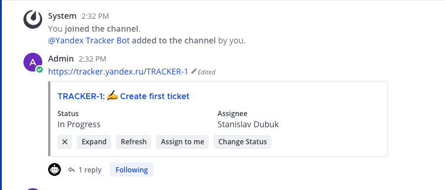
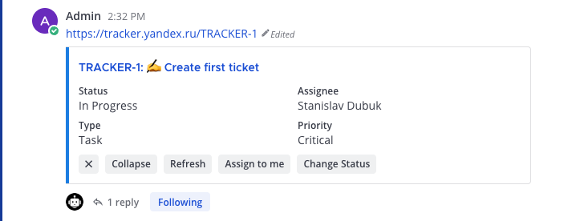
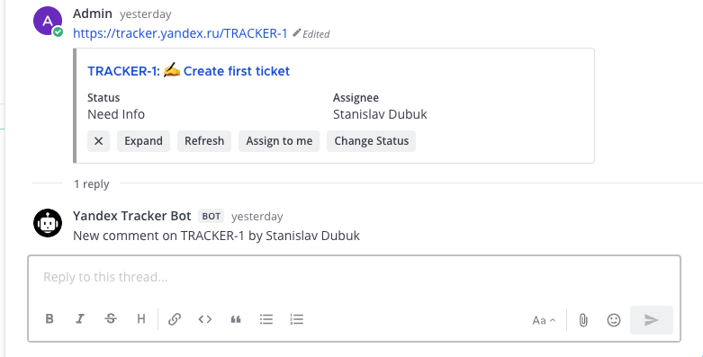
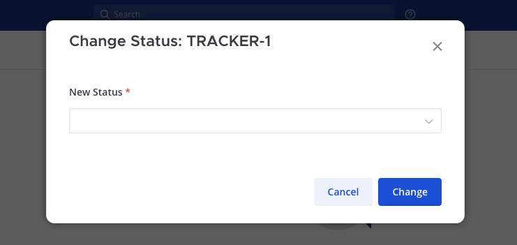
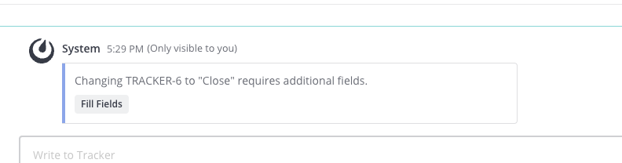
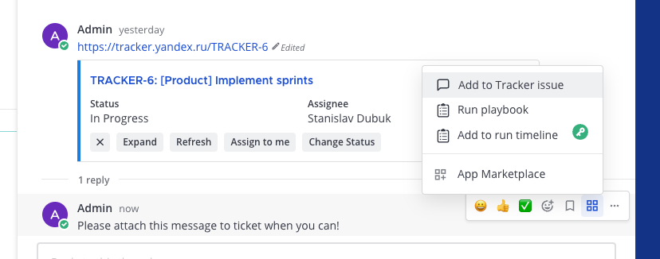
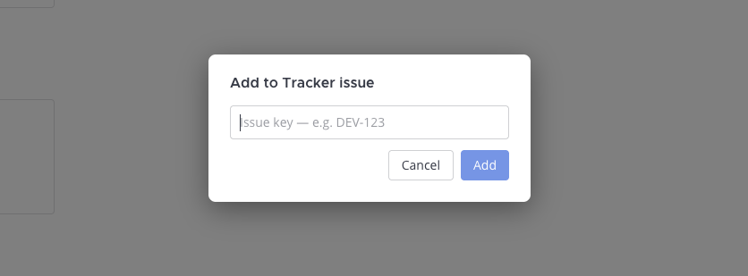
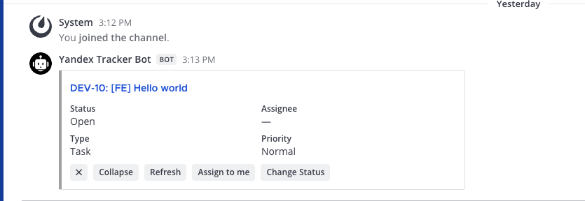

# Mattermost Yandex Tracker Plugin

[](https://github.com/dubuq/mattermost-plugin-yandex-tracker/releases/latest)

Brings Yandex Tracker issues into Mattermost — inline preview cards that update in place, webhook-driven notifications, and write actions without leaving the conversation.

Tested with Mattermost Server 9.x and Yandex Tracker Cloud and legacy 360 organizations.

## Feature summary

### Inline issue preview cards

Paste any Yandex Tracker issue key (e.g. `DEV-123`) or a full tracker URL into a message and a preview card appears inline, showing status, priority, type, and assignee. Cards are collapsed by default and can be expanded for full detail. Action buttons are always visible regardless of the card state.





### Real-time card updates

When an issue status changes in Yandex Tracker, the card on the original Mattermost message updates in place — no new bot message, no noise. Comment and assignment events post a notification reply in the issue's thread.



### Write actions

- **Assign to me** — assigns the issue to your Yandex Tracker account directly from Mattermost
- **Change Status** — opens a transition dialog; if the transition requires additional fields (e.g. resolution), a second dialog collects them
- **Add to Tracker issue** — post any Mattermost message as a comment on an issue via the `...` post menu









### Queue subscriptions

Subscribe a channel to a Yandex Tracker queue — new issues created in that queue automatically post a preview card in the channel.

```
/tracker subscribe DEV
/tracker unsubscribe DEV
/tracker subscriptions
```



### Slash command

```
/tracker DEV-123
```

Posts an ephemeral preview card for any issue (only visible to you).

---

## Getting started

### Prerequisites

- Mattermost Server **9.0** or later (self-hosted)
- Yandex Tracker access — Cloud org or legacy Yandex 360 org both supported
- A Yandex **OAuth token** and your **Organization ID** (see below)

### 1. Get your Yandex credentials

#### OAuth token

1. Go to [oauth.yandex.ru](https://oauth.yandex.ru) and create an application
2. Under **Platforms**, tick **Web services** and set the callback URL to `https://oauth.yandex.ru/verification_code`
3. Under **Access**, enable `tracker:read` and `tracker:write` under **Yandex.Tracker**
4. Save the app and copy the **Client ID**
5. Open the following URL in your browser and authorize:
   ```
   https://oauth.yandex.ru/authorize?response_type=token&client_id=YOUR_CLIENT_ID
   ```
6. Copy the token from the URL fragment (`access_token=...`). It looks like `y0_AgAA...` and is valid for 1 year.

> **IAM token alternative:** Run `yc iam create-token` with the Yandex Cloud CLI. Valid for 12 hours.

#### Organization ID

1. Go to [console.cloud.yandex.ru](https://console.cloud.yandex.ru)
2. Open **Organization settings** and copy the **Organization ID** (looks like `bpf...`)

> **Legacy organizations:** If your Tracker predates Yandex Cloud, you may have a numeric org ID sent via `X-Org-Id` instead of `X-Cloud-Org-Id`. The plugin detects which to use based on the ID format.

Verify your credentials before setting up the plugin:

```bash
curl -s \
  -H "Authorization: OAuth YOUR_TOKEN" \
  -H "X-Cloud-Org-Id: YOUR_ORG_ID" \
  "https://api.tracker.yandex.net/v2/issues/YOUR_ISSUE_KEY" | jq .
```

### 2. Build and install

```bash
git clone https://github.com/dubuq/mattermost-plugin-yandex-tracker
cd mattermost-plugin-yandex-tracker
make bundle
# creates: com.yandex-tracker-mattermost-<version>.tar.gz
```

In Mattermost: **System Console → Plugin Management → Upload Plugin** → upload the `.tar.gz` → enable the plugin.

Make sure **Enable Plugin Uploads** is `true` in **System Console → Plugin Management**.

### 3. Configure the plugin

Go to **System Console → Plugins → Yandex Tracker** and fill in:

| Field                    | Value                                                                         |
| ------------------------ | ----------------------------------------------------------------------------- |
| **Yandex Tracker Token** | OAuth token (`y0_AgAA...`)                                                    |
| **Organization ID**      | Org ID (`bpf...`)                                                             |
| **Webhook Secret**       | Any strong random string — `openssl rand -hex 32`                             |
| **Bot Display Name**     | `Tracker Bot` (or any name you prefer)                                        |
| **Monitor All Channels** | Disabled (default) — add the bot to channels you want monitored               |
| **Background Refresh**   | Every 6 hours (default) — re-fetches all tracked issues as a webhook fallback |

Click **Test Connection** to verify credentials, then **Save**.

### 4. Add the bot to channels

With **Monitor All Channels** disabled (recommended), the plugin only monitors channels where `@tracker-bot` is a member. Add the bot the same way you'd add any user:

1. Open the channel → **Members** → **Add Members**
2. Search for `tracker-bot` → Add

> The bot must be a member of the team before it can be added to individual channels. If you don't see it, go to **System Console → User Management → Teams** → add tracker-bot to the team first.

### 5. Set up webhooks

The webhook URL is shown in **System Console → Plugins → Yandex Tracker**. In Yandex Tracker, create a trigger for each event type you want:

**Status change** (updates the card in place):

```json
{ "key": "{{issue.key}}", "type": "issueUpdated" }
```

**New comment** (bot replies in the issue thread):

```json
{
  "key": "{{issue.key}}",
  "type": "commentCreated",
  "author": "{{comment.author.display}}"
}
```

**Assignee changed** (bot replies in the issue thread):

```json
{
  "key": "{{issue.key}}",
  "type": "issueAssigned",
  "assignee": "{{issue.assignee.display}}"
}
```

**Issue created** (posts card in subscribed channels):

```json
{ "key": "{{issue.key}}", "type": "issueCreated" }
```

Set `Content-Type: application/json` and `X-Webhook-Secret: <your secret>` as headers on each trigger.

---

## Configuration reference

### Status colors

Cards display a colored left border based on the issue's status. Configure which statuses map to which color under **Card Color** settings. Each color slot has two fields:

| Field                      | Example value                             |
| -------------------------- | ----------------------------------------- |
| **Card Color — Active**    | `#1E88E5`                                 |
| **Statuses — Active**      | `In Progress, In Review, В работе`        |
| **Card Color — Done**      | `#43A047`                                 |
| **Statuses — Done**        | `Closed, Resolved, Закрыт, Решён`         |
| **Card Color — Cancelled** | `#E53935`                                 |
| **Statuses — Cancelled**   | `Cancelled, Won't fix, Отменён, Дубликат` |
| **Card Color — Default**   | `#AAAAAA`                                 |
| **Card Color — Custom**    | `#9C27B0` (optional 5th slot)             |
| **Statuses — Custom**      | `On Hold, На паузе`                       |

Status names are matched **case-insensitively**. The Default color applies to any status not matched by the other groups. Leave a color field blank to use the Mattermost theme default.

To find the exact status names for your Tracker, open any issue in Yandex Tracker and note the status label as shown in the UI — use those exact strings in the comma-separated lists.

### Required fields for transitions

Some status transitions in Yandex Tracker require additional fields before they can execute (e.g. closing an issue requires choosing a resolution). Configure these under **Required Fields by Transition** as a JSON object.

#### Format

```json
{
  "Transition Name": {
    "fieldApiKey": {
      "Display Label": "apiValue",
      "Display Label 2": "apiValue2"
    },
    "anotherField": {}
  }
}
```

- The top-level key is the **transition name** as shown in the Change Status dialog (matched case-insensitively)
- Each field entry is either:
  - A **non-empty object** `{"Label": "apiKey", ...}` — renders as a dropdown; the label is shown to the user, the API key is sent to Tracker
  - An **empty object** `{}` — renders as a free-text input; the value is sent as-is

#### Finding field API keys and values

1. In Yandex Tracker, open an issue and manually execute the transition you want to configure
2. In your browser DevTools → Network tab, find the `POST /v2/issues/<KEY>/transitions/<id>/_execute` request
3. The request body shows the field keys and values Tracker expects (e.g. `{"resolution": {"key": "fixed"}}`)

#### Example — closing with resolution

Yandex Tracker's "Close" transition requires a `resolution` field. The available resolutions for your queue can be found in **Queue settings → Resolutions**.

```json
{
  "Закрыть": {
    "resolution": {
      "Решено": "fixed",
      "Не будет исправлено": "wontFix",
      "Дубликат": "duplicate"
    }
  },
  "Close": {
    "resolution": {
      "Fixed": "fixed",
      "Won't fix": "wontFix",
      "Duplicate": "duplicate"
    }
  }
}
```

When a user clicks **Change Status** and selects "Закрыть", the plugin detects the required `resolution` field, shows an intermediate **Fill Fields** dialog with a dropdown of the three options, and then executes the transition with `{"resolution": {"key": "fixed"}}` (or whichever value was selected).

Transitions without an entry in this config execute immediately with no intermediate dialog.

---

## Usage

### Assign to me

Expand a card and click **Assign to me**. The first time you use this, a dialog asks for your **Yandex Tracker login** — this is your Yandex account username (the part before `@` in your Yandex email, or the login shown in your Tracker profile). The login is saved and not asked again.

### Change Status

Expand a card and click **Change Status** to see available transitions for the current issue state. If a transition requires additional fields (e.g. a resolution when closing), a second **Fill Fields** dialog appears automatically. After submitting, the card updates to reflect the new status.

### Add to Tracker issue

Hover over any Mattermost message → click `...` → **Add to Tracker issue**. A dialog asks for the issue key (`DEV-123`). The message text is posted as a comment on that Tracker issue. Useful for pushing AI-generated thread summaries or decisions from a Mattermost discussion directly into the relevant issue.

### Slash commands

| Command                      | Description                                                            |
| ---------------------------- | ---------------------------------------------------------------------- |
| `/tracker KEY`               | Post an ephemeral preview card for any issue (only visible to you)     |
| `/tracker subscribe QUEUE`   | Subscribe the current channel to a queue — new issues auto-post a card |
| `/tracker unsubscribe QUEUE` | Remove the channel's subscription to a queue                           |
| `/tracker subscriptions`     | List all queues the current channel is subscribed to                   |

### Card lifecycle

Cards that have not received a status update for **7 days** are automatically removed from tracking. If a card stops updating, paste the issue key again to re-track it. This keeps the plugin's storage and background API usage bounded over time.

---

## Development

This plugin contains both a server (Go) and webapp (React/TypeScript) portion. Read the Mattermost documentation about [Developer Workflow](https://developers.mattermost.com/integrate/plugins/developer-workflow/) and [Developer Setup](https://developers.mattermost.com/integrate/plugins/developer-setup/) for more information.

### Local setup

```bash
# Server
go build ./server/...

# Webapp
cd webapp && yarn && yarn build

# Full plugin bundle
make bundle
```

To deploy directly to a local Mattermost instance:

```bash
export MM_SERVICESETTINGS_SITEURL=http://localhost:8065
export MM_ADMIN_USERNAME=admin
export MM_ADMIN_PASSWORD=admin
make deploy
```

For webhook testing without a public server, use [ngrok](https://ngrok.com):

```bash
ngrok http 8065
# Use the ngrok URL as your MM SiteURL and as the webhook URL in Yandex Tracker triggers
```

### Releasing new versions

This project uses [semantic versioning](https://semver.org):

- **Patch** `v0.1.0 → v0.1.1` — bug fixes
- **Minor** `v0.1.0 → v0.2.0` — new features, backwards compatible
- **Major** `v0.1.0 → v1.0.0` — breaking changes or significant milestone

To release:

1. Update `version` in `plugin.json`
2. Add an entry to `CHANGELOG.md`
3. `git tag v<version> && git push origin v<version>`
4. Create a GitHub release from the tag and attach the built `.tar.gz`

---

## License

This repository is licensed under the [Apache 2.0 License](LICENSE).

---

## Help and support

- To report a bug, please [open an issue](https://github.com/dubuq/mattermost-plugin-yandex-tracker/issues)
- For feature requests, open an issue or submit a pull request
